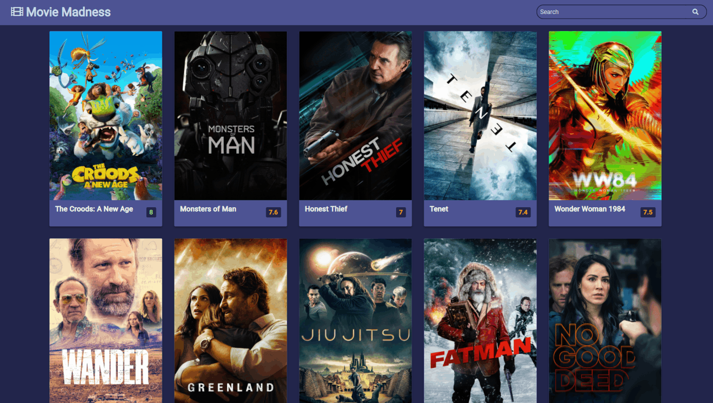

#  🎬🍿 Movie Madness 🍿🎬

## ℹ About

Search for movies by title to see the overview, image and rating.
The application sends a fetch request to [The Movie DB](https://www.themoviedb.org/) for information to display

## 💡 Learning Outcome

This aim of this project was to take a vanilla JS app I had previously made and refactor it into a React application. The [original application](https://github.com/bronwyncarr/50_projects_50_days) was created from the movie app in [50 Projects in 50 Days](https://www.udemy.com/course/50-projects-50-days/) course by Brad Traversy and Florin Pop.

## 🎥 Application Functionality

## 📋 References

[50 Projects in 50 Days](https://www.udemy.com/course/50-projects-50-days/) by Brad Traversy and Florin Pop for original concept and styling.